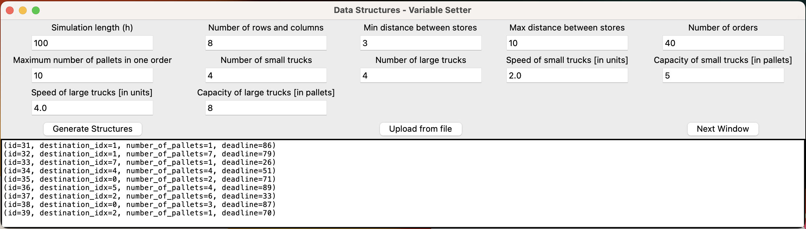
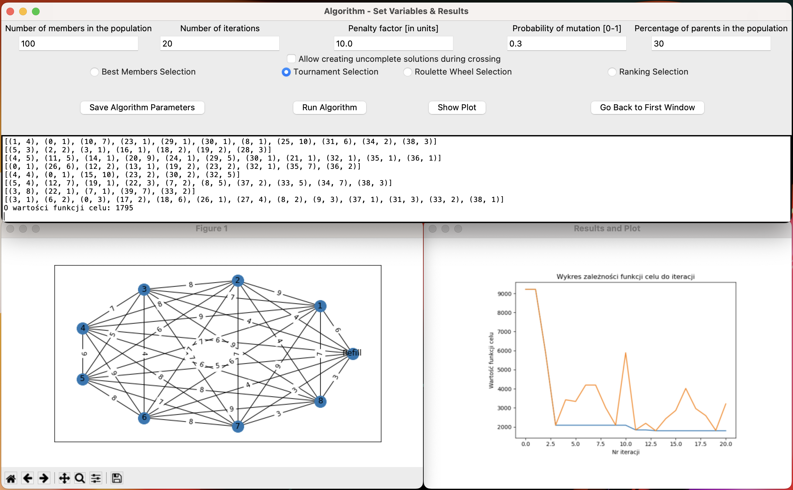

# IMPLEMENTATION OF A GENETIC ALGORITHM TO OPTIMISE A TRANSPORTATION THEORY PROBLEM

Example usage:

## First window to generate the data structures



### Second window to set the variables of the algorithm and outputs



## REQUIREMENTS

To use this application it is necessary to have Python 3 and modules specified in the file 'requirements.txt' installed.
Temporarily, to run the program enter this command in the terminal in the folder to which the repo is cloned:

```zsh
python gui.py
```

## DOCUMENTATION

WIP for an engineering thesis. The branch engineering_thesis is just my solo work, taking what was already there in the project of 3 people.

Piotr Suchy
