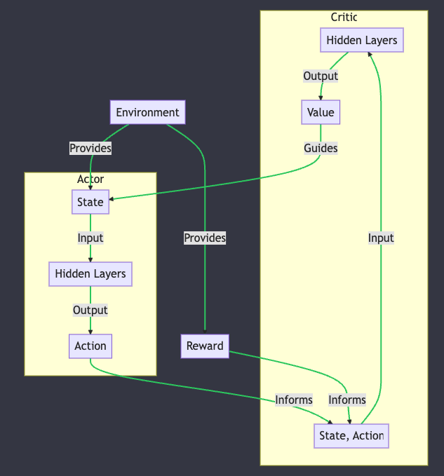

# IMPLEMENTATION OF A GENETIC ALGORITHM TO OPTIMISE A TRANSPORTATION THEORY PROBLEM

Example usage:

## First window to generate the data structures


### Second window to set the variables of the algorithm and outputs


## REQUIREMENTS

To use this application it is necessary to have Python 3 and modules specified in the file 'requirements.txt' installed.
Temporarily, to run the program enter this command in the terminal in the folder to which the repo is cloned:

```zsh
python gui.py
```

## DOCUMENTATION

WIP for an engineering thesis. The branch engineering_thesis is just my solo work, taking what was already there in the project of 3 people.

## NEXT STEP

Approach the transportation problem optimization from a neural network, reinforcement learning method point of view. TODO:

1. Define the environment: Create an environment class that represents the transportation problem. It should include the state (e.g., the current position of each truck, the remaining orders, and the remaining deadlines), the actions (e.g., move a truck to a vertex, deliver an order), and the rewards (e.g., positive reward for successful delivery, negative reward for exceeding the deadline).

2. Create a state representation: You'll need a way to represent the state of the problem as input to the neural network. You can use the Graph, truck_list, and order_lst data to create a feature vector. For example, you can represent the truck's position, the remaining deadlines, and the remaining pallets for each order as a concatenated vector.

3. Define the neural network architecture: Design the neural network that will be used by the RL agent to learn the optimal policy. You can use a deep Q-network (DQN) or other RL algorithms like Actor-Critic or Proximal Policy Optimization (PPO).

4. Train the agent: Train the RL agent using your defined environment, state representation, and neural network architecture. You'll need to experiment with different hyperparameters and training configurations to find the best solution.

5. Evaluate the performance: After the training is complete, test the performance of the trained agent on a set of test instances to see how well it has learned to solve the transportation problem.

## VISUALISATION OF THE REINFORCEMENT LEARNING ALGORITHM



Piotr Suchy
